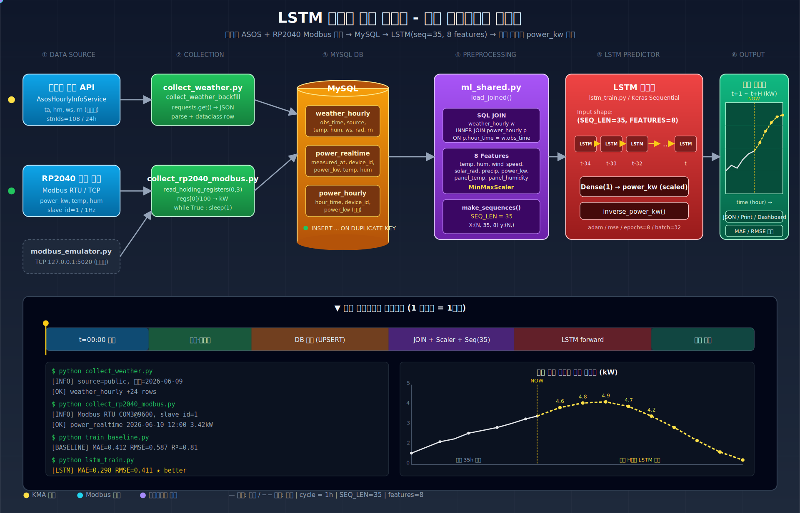

# LSTM 발전량 예측 시스템

기상청 ASOS 공공 API와 RP2040 현장 실측(Modbus) 데이터를 MySQL에 적재하고,
LSTM 모델로 **현재 시각 이후 시간별 발전량(kW)** 을 예측하는 파이프라인.

## 전체 시스템 블록도 / 동작 시뮬레이션

<p align="center">
  
</p>

> SVG 파일을 직접 열면([system_simulation.svg](./system_simulation.svg)) 패킷 흐름·타임라인 진행 헤드·예측 곡선 등 SMIL 애니메이션이 재생됩니다.

---

## 1. 시스템 구성

```
┌─────────────┐   ┌──────────────┐   ┌─────────┐   ┌──────────────┐   ┌──────────┐   ┌────────┐
│ 기상청 API   │──▶│ collect_*.py │──▶│  MySQL  │──▶│ ml_shared.py │──▶│  LSTM    │──▶│ 예측 kW │
│ RP2040 Modbus│   │              │   │  3 tables│   │ JOIN+Scaler  │   │ Keras    │   │  t+1..H │
└─────────────┘   └──────────────┘   └─────────┘   └──────────────┘   └──────────┘   └────────┘
     ①                  ②                ③               ④                  ⑤            ⑥
```

| 단계 | 파일 | 역할 |
|---|---|---|
| ① 데이터 소스 | `weather_public.py` | 기상청 ASOS 시간별 API (`AsosHourlyInfoService`) |
| ① 데이터 소스 | `modbus_emulator.py` | RP2040 대체 Modbus TCP 에뮬레이터 (개발용) |
| ② 수집 | `collect_weather.py` | 기상 API 1일분 JSON 수집 |
| ② 수집 | `collect_weather_backfill.py` | N일 backfill → DB 저장 |
| ② 수집 | `collect_rp2040_modbus.py` | Modbus RTU/TCP → power_kw/temp/hum (1Hz) |
| ③ DB | `db.py` | MySQL 연결 / `weather_hourly` UPSERT |
| ④ 전처리 | `ml_shared.py` | JOIN, `MinMaxScaler`, `SEQ_LEN=35`, 8 features |
| ⑤ 학습 | `train_baseline.py` | HistGradientBoosting 베이스라인 |
| ⑤ 학습 | `lstm_train.py` | Keras `LSTM(64)` → `Dense(1)` |

---

## 2. MySQL 테이블

| 테이블 | 주요 컬럼 |
|---|---|
| `weather_hourly` | `obs_time`, `source`, `temperature`, `humidity`, `wind_speed`, `solar_radiation`, `precipitation` |
| `power_realtime` | `measured_at`, `device_id`, `power_kw`, `temperature`, `humidity` |
| `power_hourly`   | `hour_time`, `device_id`, `power_kw` (시간별 집계) |

INSERT 는 모두 `ON DUPLICATE KEY UPDATE` 로 멱등 처리.

---

## 3. 모델 입력

```python
SEQ_LEN  = 35
FEATURES = [
    "temperature", "humidity", "wind_speed",
    "solar_radiation", "precipitation",
    "power_kw", "panel_temp", "panel_humidity",
]
TARGET = "power_kw"
```

- 입력 shape : `(N, 35, 8)` — 직전 35시간 × 8 feature
- 출력      : `(N, 1)`     — 다음 시간 `power_kw`
- 스케일링  : `MinMaxScaler` (예측 후 `inverse_power_kw()` 로 kW 복원)

---

## 4. 환경 변수 (`.env`)

```ini
# MySQL
MYSQL_HOST=127.0.0.1
MYSQL_PORT=3306
MYSQL_USER=weather
MYSQL_PASSWORD=weatherpass
MYSQL_DATABASE=weather

# 기상청 공공데이터포털
DATA_GO_KR_SERVICE_KEY=<발급키>
ASOS_STN_ID=108              # 서울
WEATHER_SOURCE=public        # public | openmeteo

# Modbus
MODBUS_MODE=tcp              # rtu | tcp
MODBUS_HOST=127.0.0.1
MODBUS_TCP_PORT=5020
MODBUS_PORT=COM3
MODBUS_BAUD=9600
MODBUS_SLAVE_ID=1
DEVICE_ID=RP2040-EMU-01
```

`.env` 는 `.gitignore` 에 포함되어 커밋되지 않음.

---

## 5. 실행 순서

```bash
# 0) 의존성 (uv 사용)
uv sync

# 1) 기상 데이터 30일 backfill
uv run python collect_weather_backfill.py 30

# 2) Modbus 에뮬레이터 (별도 터미널, 개발용)
uv run python modbus_emulator.py

# 3) RP2040 실측 수집 (1초 주기)
uv run python collect_rp2040_modbus.py

# 4) 베이스라인 학습 (HistGradientBoosting)
uv run python train_baseline.py

# 5) LSTM 학습 + 베이스라인과 MAE 비교
uv run python lstm_train.py
```

---

## 6. 동작 시뮬레이션

`system_simulation.svg` 를 브라우저로 열면 SMIL 애니메이션 재생:

- 데이터 패킷이 `Source → Collect → MySQL → Preprocess → LSTM → Output` 경로를 흐름
- 1시간 사이클 진행 헤드가 타임라인 좌→우 스윕
- LSTM unfold 셀(`t-34 ~ t`)과 미래 H시간 예측 곡선이 노란 점선으로 표시

---

## 7. 디렉터리

```
lstm/
├── collect_weather.py
├── collect_weather_backfill.py
├── collect_rp2040_modbus.py
├── modbus_emulator.py
├── weather_public.py
├── db.py
├── ml_shared.py
├── train_baseline.py
├── lstm_train.py
├── main.py
├── system_simulation.svg     # 시스템 블록도 + 동작 시뮬레이션
├── pyproject.toml
└── README.md
```
